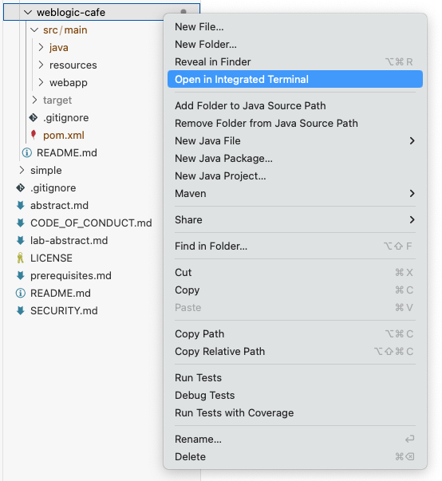
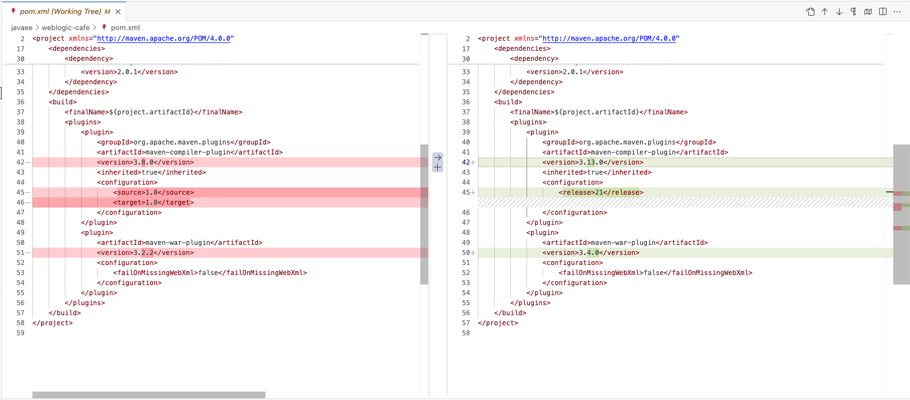
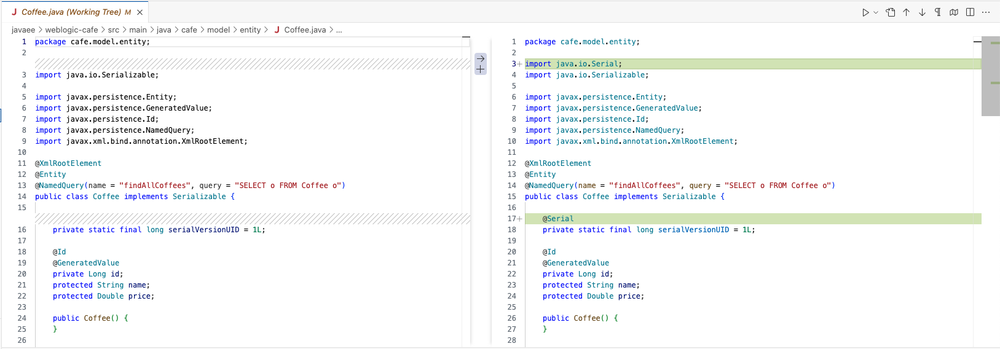

# Migrate WebLogic Cafe to WLS 14.1.2

As of WebLogic Server 14.1.2, Oracle provides OpenRewrite recipes to help you upgrade your applications to new WebLogic and Java versions. This tutorial demonstrates how to use the recipes to upgrade a sample application to run on WebLogic Server 14.1.2 with JDK 21.

## WebLogic Cafe Example

We'll step through this tutorial using the WebLogic Cafe example that is available on GitHub: [`https://github.com/microsoft/weblogic-on-azure`](https://github.com/microsoft/weblogic-on-azure). This is a simplified Java EE application that is used in many demos. We will run the `rewrite-weblogic` recipes locally, so we'll need a copy of the code locally, too.

### Step 1: Start by making sure that you have the prerequisites

1. Make sure that you have Java 8 or later installed.
1. Make sure that you have Maven 3.x installed.
1. Clone the `weblogic-on-azure` repo:

```shell
git clone https://github.com/microsoft/weblogic-on-azure.git
```

```shell
cd weblogic-on-azure/javaee/weblogic-cafe
```

### Step 2: Sync Maven dependencies

For OpenRewrite to run, Maven dependencies must be resolved. If needed, run `mvn clean install` for missing dependencies:

```shell
mvn clean install
```

Or, you can use other commands as well, such as `mvn dependency:resolve`.

### Step 3: Run the Maven command to run OpenRewrite

For this example, we will upgrade the WebLogic Cafe application to run on WebLogic Server 14.1.2 with JDK 21. Alternatively, you can upgrade the application to run on WebLogic Server 14.1.2 with JDK 17.

1. Open a terminal at the `weblogic-cafe` folder.

    You must open to the folder where the POM file is located:
    ``` weblogic-on-azure/javaee/weblogic-cafe ```

    Preferably, you should open a terminal within your IDE.

    

1. Run the following command to run OpenRewrite:

```shell
mvn -U org.openrewrite.maven:rewrite-maven-plugin:run \
  -Drewrite.recipeArtifactCoordinates=com.oracle.weblogic.rewrite:rewrite-weblogic:LATEST \
  -Drewrite.activeRecipes=com.oracle.weblogic.rewrite.UpgradeTo1412,org.openrewrite.java.migrate.UpgradeToJava21
```

This command applies the following recipes:

- `com.oracle.weblogic.rewrite.UpgradeTo1412`
- `org.openrewrite.java.migrate.UpgradeToJava21`

OpenRewrite updates the `weblogic-cafe` code in the following ways:

- `pom.xml` – updates versions and namespaces
- Source files –
  - Updates Java dependencies and related statements.
  - Updates WebLogic API dependencies and related statements.
  - For removed APIs with no replacement, OpenRewrite inserts a comment in the code stating that the API usage needs to be resolved or removed.

### Step 3: Review the results

The easiest way to see the results of the upgrade is to compare the updated files to the previous version in GitHub or in your IDE.

For example, the following image shows file changes for the ```pom.xml``` file in VS Code:



The following image shows a source file with code changes applied:



### Step 4: Deploy the application

Optionally, if you have a WebLogic 14.1.2 domain available, deploy the WebLogic Cafe example application using your standard deployment tools.
